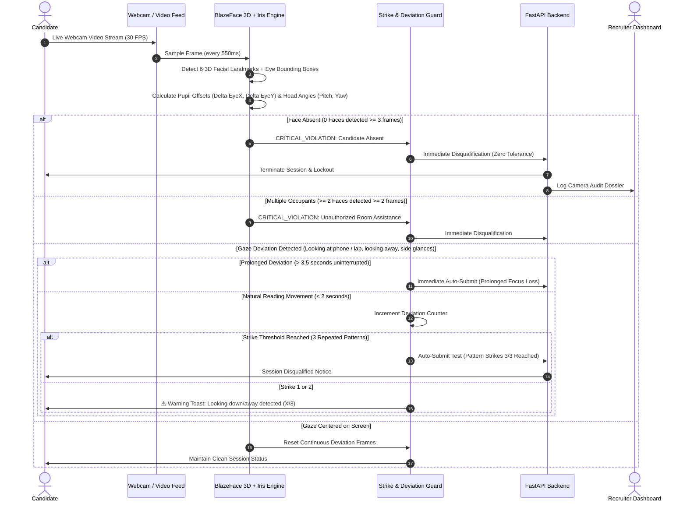
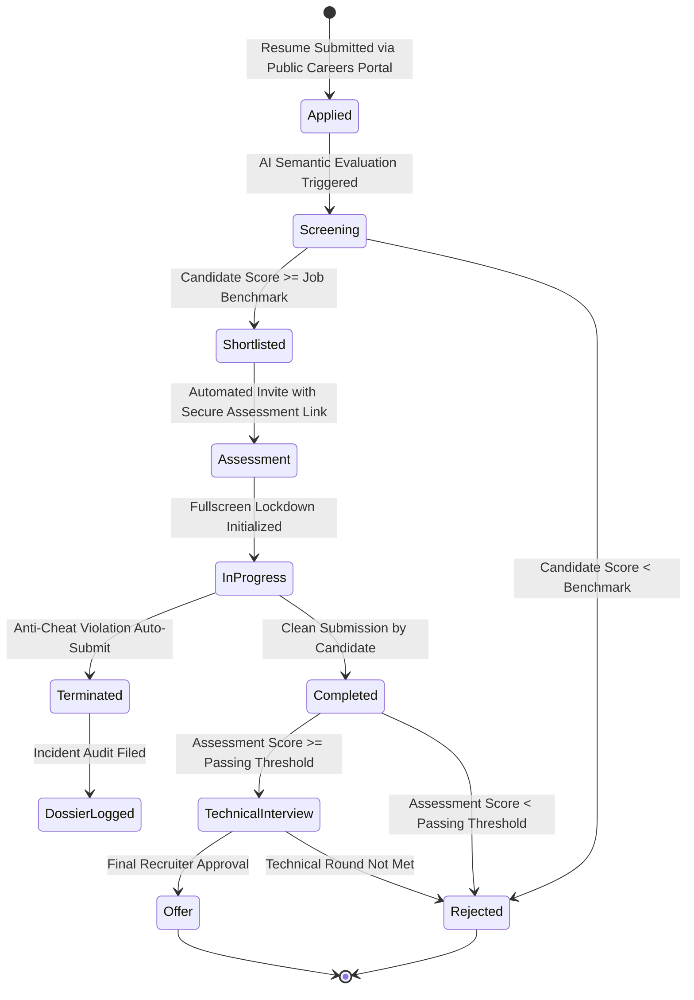

# TalentIQ — AI-Powered Autonomous Recruitment & Proctoring Platform

<div align="center">

[](https://fastapi.tiangolo.com)
[](https://www.python.org/)
[](https://react.dev/)
[](https://www.typescriptlang.org/)
[](https://www.tensorflow.org/js)
[](https://tailwindcss.com/)
[](LICENSE)

<p align="center">
  <strong>An enterprise-grade, full-lifecycle recruitment automation suite featuring AI resume semantic scoring, autonomous computer vision proctoring with 3D gaze vector analytics, and a distraction-free full-screen testing workstation.</strong>
</p>

</div>

---

## 📑 Table of Contents
- [Executive Overview](#-executive-overview)
- [System Architecture](#-system-architecture)
  - [High-Level System Topology](#high-level-system-topology)
  - [Autonomous Proctoring Decision Flow](#autonomous-proctoring-decision-flow)
  - [Candidate Lifecycle Pipeline](#candidate-lifecycle-pipeline)
- [Core Feature Highlights](#-core-feature-highlights)
  - [1. Intelligent ATS & Semantic Resume Screener](#1-intelligent-ats--semantic-resume-screener)
  - [2. Autonomous Computer Vision Proctoring Suite](#2-autonomous-computer-vision-proctoring-suite)
  - [3. Full-Screen Edge-to-Edge Assessment Workstation](#3-full-screen-edge-to-edge-assessment-workstation)
  - [4. Automated Communications & Interview Dispatcher](#4-automated-communications--interview-dispatcher)
  - [5. Forensic Termination Audit Dossier](#5-forensic-termination-audit-dossier)
- [Proctoring Security Matrix](#-proctoring-security-matrix)
- [Project Directory Structure](#-project-directory-structure)
- [API Reference](#-api-reference)
- [Getting Started](#-getting-started)
  - [Prerequisites](#prerequisites)
  - [Backend Setup](#backend-setup)
  - [Frontend Setup](#frontend-setup)
  - [Environment Variables](#environment-variables)
- [Contributing & License](#-contributing--license)

---

## 🚀 Executive Overview

**TalentIQ** revolutionizes corporate technical vetting by combining large language model intelligence with real-time browser-based computer vision. Traditional hiring pipelines suffer from high manual screening fatigue, fragmented interview scheduling, and rampant cheating during remote technical evaluations. 

TalentIQ solves these challenges with:
1. **Zero-Touch Resume Parsing & Scoring**: Deep semantic matching between candidate resumes and job descriptions using Google Gemini AI.
2. **Autonomous Gaze & Head-Pose Proctoring**: Client-side TensorFlow BlazeFace 3D neural tracking calculates facial orientation (pitch, yaw, roll) and biometric iris/pupil excursion vectors to prevent mobile phone cheating, second-screen glancing, and unauthorized assistance.
3. **Full-Screen Testing Station**: An edge-to-edge, single-window testing workstation with zero boxed card nesting, pinned camera proctor telemetry, and a 3-strike pattern auto-submit engine.
4. **Autonomous Candidate Lifecycle Orchestration**: Automated progression across hiring stages with real-time email notifications and Google Meet interview scheduling.

---

## 🏗️ System Architecture

### High-Level System Topology

```mermaid
graph TB
    subgraph Client Layer ["Client Tier (React 19 + TypeScript + Vite)"]
        A1[Recruiter ATS Dashboard]
        A2[Public Careers & Job Portal]
        A3[Full-Screen Proctored Workstation]
        A4[TensorFlow.js BlazeFace 3D Engine]
    end

    subgraph API Gateway ["API Gateway (FastAPI Async Core)"]
        B1["/api/v1/auth & /deps"]
        B2["/api/v1/jobs & /pipeline"]
        B3["/api/v1/candidates & /resumes"]
        B4["/api/v1/assessments & /proctor"]
        B5["/api/v1/interviews & /emails"]
    end

    subgraph AI Intelligence Layer ["AI & Computer Vision Engines"]
        C1[Gemini AI Semantic Screener]
        C2[Resume Information Extraction]
        C3[BlazeFace 3D Iris & Pupil Tracker]
        C4[Dynamic Baseline Calibration]
    end

    subgraph Persistence Layer ["Storage & Database Layer"]
        D1[(SQLAlchemy ORM: SQLite / PostgreSQL)]
        D2[Encrypted Resume Document Store]
        D3[Timestamped Proctor Audit Logs]
    end

    subgraph External Services ["External Dispatch Providers"]
        E1[SMTP Email Engine: Gmail / SendGrid]
        E2[Google Meet Conference Dispatcher]
    end

    A1 & A2 & A3 --> API Gateway
    A3 <--> A4
    A4 -.-> C3 & C4
    B3 --> C1 & C2
    API Gateway --> Persistence Layer
    B5 --> External Services
```

---

### Autonomous Proctoring Decision Flow

The proctoring engine runs locally inside the candidate's browser at ~2 frames per second using TensorFlow.js, guaranteeing ultra-low latency without saturating network bandwidth.



---

### Candidate Lifecycle Pipeline



---

## 🌟 Core Feature Highlights

### 1. Intelligent ATS & Semantic Resume Screener
- **Automated Resume Extraction**: Ingests PDF and text resumes, isolating technical skillsets, project history, and total years of relevant experience.
- **Deep Semantic Matching**: Matches candidate profiles against role requirements using structured prompt engineering on Gemini AI, producing:
  - Overall Compatibility Match Percentage (0–100%).
  - Matched core competencies and missing required skills.
  - Executive hiring recommendation summary.
- **Interactive Kanban Pipeline**: Drag-and-drop recruiter board allowing seamless progression across all 6 candidate stages.

### 2. Autonomous Computer Vision Proctoring Suite
- **TensorFlow BlazeFace 3D Neural Mesh**: Local execution detecting facial orientation without server processing costs or privacy liabilities.
- **Biometric Iris & Pupil Excursion Vectoring**:
  - Horizontal pupil tracking ($|\Delta EyeX| > 0.32$) detects side glances toward secondary monitors or notes.
  - Vertical pupil tracking ($\Delta EyeY > 0.32$) detects downward gaze directed at mobile phones or desk lap surfaces.
  - Upper ceiling stare detection ($\Delta EyeY < -0.32$ or $pitch > 2.6$).
- **Dynamic Resting Baseline Calibration**: Calibrates against the candidate's natural resting eye line when facing their monitor during onboarding.
- **Adaptive 3-Strike Pattern Engine**: Tolerates momentary human eye movements during cognitive problem solving; persistently penalizes repeated cheating habits with automatic disqualification on Strike 3.
- **Immediate Disqualification Handlers**:
  - Exiting fullscreen mode (`fullscreenchange`).
  - Switching browser tabs or minimizing windows (`visibilitychange`).
  - Absence from camera view for $>1.5$ seconds.
  - Multiple individuals detected in camera view.

### 3. Full-Screen Edge-to-Edge Assessment Workstation
- **Distraction-Free Enterprise Layout**: Full viewport utilization (`100vw x 100vh`) eliminating dated card-in-card dialog boxes.
- **Docked AI Camera Proctor**: Live video feed integrated directly into the left navigation sidebar with real-time pupil telemetry (`PUPIL: CENTERED / OFFSET`) and illuminated pattern strike dots (`[• • •] X/3`).
- **Interactive Question Palette**: Direct access to any assessment problem with instant visual states for Answered (emerald), Active (indigo), and Unanswered (slate).
- **Proctoring Lockdown Environment**: Disables right-click context menu, text selection, copy/cut/paste, developer shortcut keys (F12, Ctrl+Shift+I, Ctrl+U), and window switching.

### 4. Automated Communications & Interview Dispatcher
- **Transactional Email Automation**: Automated delivery of candidate receipts, test invitations with secure cryptographic tokens, and rejection notifications.
- **Google Meet Scheduling**: Automatically generates virtual interview meeting rooms upon passing technical assessment thresholds.

### 5. Forensic Termination Audit Dossier
- **Automated Evidence Logging**: If a candidate violates integrity guidelines, their exam is auto-submitted instantly, and a forensic incident dossier is logged.
- **Detailed Violation Audit**: Records the exact trigger reason, computer vision model telemetry, timestamp, and saved answers up to the point of disqualification.

---

## 🔒 Proctoring Security Matrix

| Violation Pattern | Technical Detection Algorithm | Detection Sensitivity | Enforcement Action |
| :--- | :--- | :--- | :--- |
| **Mobile Phone / Lap Stare** | $\Delta EyeY > 0.32$ or $pitch < 0.22$ | $> 2$ frames (deviation confirmed) | Warning Toast (Strikes 1 & 2) ➔ **Immediate Auto-Submit on Strike 3** |
| **Prolonged Phone Focus** | $\Delta EyeY > 0.32$ continuously | $> 3.5$ seconds uninterrupted | **Zero-Tolerance Auto-Submit & Disqualification** |
| **Side Glances (2nd Monitor)** | $|\Delta EyeX| > 0.32$ or $|yaw| > 0.36$ | $> 2$ frames | Warning Toast (Strikes 1 & 2) ➔ **Immediate Auto-Submit on Strike 3** |
| **Ceiling Stare** | $\Delta EyeY < -0.32$ or $pitch > 2.6$ | $> 2$ frames | Warning Toast (Strikes 1 & 2) ➔ **Immediate Auto-Submit on Strike 3** |
| **Candidate Absent** | BlazeFace returns 0 faces | $\ge 3$ frames ($> 1.5$s) | **Immediate Auto-Submit & Disqualification** |
| **Unauthorized Assistance** | BlazeFace returns $\ge 2$ faces | $\ge 2$ frames ($> 1.0$s) | **Immediate Auto-Submit & Disqualification** |
| **Fullscreen Breach** | `document.fullscreenElement === null` | Instant event trigger | **Immediate Auto-Submit & Disqualification** |
| **Window / Tab Navigation** | `document.hidden === true` | Instant event trigger | **Immediate Auto-Submit & Disqualification** |
| **Clipboard & DevTools** | Clipboard and keyboard event overrides | Instant event trigger | **Prohibited & Alert Toast Displayed** |

---

## 📁 Project Directory Structure

```text
AI-Powered-Recruitment-Automation/
├── backend/
│   ├── app/
│   │   ├── api/                     # RESTful API Route Controllers
│   │   │   ├── assessments.py       # Proctoring submission, audit, reset API
│   │   │   ├── auth.py              # JWT authentication endpoints
│   │   │   ├── candidates.py        # Candidate profile & resume upload API
│   │   │   ├── dashboard.py         # ATS pipeline metrics & KPIs
│   │   │   ├── deps.py              # Database & authentication dependencies
│   │   │   ├── emails.py            # Email log & direct dispatch API
│   │   │   ├── interviews.py        # Interview calendar & Google Meet scheduling
│   │   │   ├── jobs.py              # Job vacancy management endpoints
│   │   │   ├── pipeline.py          # Candidate stage transition handlers
│   │   │   └── public.py            # Public careers portal API
│   │   ├── core/                    # Core Infrastructure & Configurations
│   │   │   ├── config.py            # Pydantic Settings & environment loader
│   │   │   ├── database.py          # SQLAlchemy engine & session factory
│   │   │   └── security.py          # Password hashing & JWT token generators
│   │   ├── models/                  # SQLAlchemy Relational ORM Models
│   │   ├── schemas/                 # Pydantic Validation & Serialization Schemas
│   │   ├── services/                # Business Logic & AI Services
│   │   │   ├── email_service.py     # SMTP dispatcher with HTML templates
│   │   │   ├── gemini_service.py    # Google Gemini AI client integration
│   │   │   ├── matching_service.py  # Candidate-job semantic fit engine
│   │   │   └── resume_parser.py     # PDF parsing & text extraction
│   │   ├── main.py                  # FastAPI Application Factory & CORS
│   │   └── seed.py                  # Realistic enterprise demo dataset seeder
│   ├── tests/                       # Pytest Automated Test Suite
│   ├── pytest.ini                   # Test configuration
│   └── requirements.txt             # Python production dependencies
│
├── frontend/
│   ├── public/                      # Static brand assets & SVG icons
│   ├── src/
│   │   ├── assets/                  # UI vector graphics & illustrations
│   │   ├── components/              # Modular UI Components
│   │   │   ├── modals/              # Recruiter action & schedule dialogs
│   │   │   ├── Header.tsx           # Global ATS navigation header
│   │   │   └── Sidebar.tsx          # Collapsible enterprise navigation menu
│   │   ├── pages/                   # Application Views & Portals
│   │   │   ├── AssessmentsView.tsx  # Recruiter assessment management view
│   │   │   ├── CandidateAssessmentPortal.tsx # Full-Screen Proctored Workstation
│   │   │   ├── CandidatesView.tsx   # Searchable talent directory
│   │   │   ├── DashboardView.tsx    # ATS Executive Analytics & KPIs
│   │   │   ├── EmailsView.tsx       # Real-time email dispatch activity logs
│   │   │   ├── InterviewsView.tsx   # Calendar & Google Meet interview manager
│   │   │   ├── JobsView.tsx         # Job vacancy creation & candidate lists
│   │   │   ├── PipelineView.tsx     # Interactive drag-and-drop Kanban board
│   │   │   ├── PublicApplyView.tsx  # Candidate job application submission
│   │   │   └── PublicCareersView.tsx# Public careers portal for applicants
│   │   ├── services/
│   │   │   ├── api.ts               # Unified Axios/Fetch API client
│   │   │   └── proctoringModel.ts   # TensorFlow BlazeFace 3D & Iris Vector Engine
│   │   ├── types/                   # TypeScript interfaces and domain types
│   │   ├── App.tsx                  # Root Routing & Shell Layout
│   │   ├── index.css                # Tailwind CSS v4 design tokens & theme
│   │   └── main.tsx                 # React application DOM mount
│   ├── package.json                 # Frontend dependencies & scripts
│   ├── tsconfig.json                # TypeScript project configuration
│   └── vite.config.ts               # Vite 8 build & bundler configuration
│
├── .gitignore                       # Multi-tier exclusion rules
├── PRD.md                           # Product Requirements Specification
└── README.md                        # Master Platform Documentation
```

---

## 📡 API Reference

| Endpoint | Method | Description | Auth Required |
| :--- | :---: | :--- | :---: |
| `/api/v1/auth/login` | `POST` | Authenticate recruiter & issue JWT token | No |
| `/api/v1/dashboard/stats` | `GET` | Retrieve hiring pipeline metrics & active counts | Yes |
| `/api/v1/jobs` | `GET` / `POST` | List all vacancies or create new job posting | Yes |
| `/api/v1/public/jobs` | `GET` | List active vacancies on public careers page | No |
| `/api/v1/public/apply/{job_id}` | `POST` | Submit job application with PDF resume | No |
| `/api/v1/candidates` | `GET` | Search and filter candidate talent database | Yes |
| `/api/v1/pipeline/{app_id}/stage` | `PATCH` | Advance candidate to next recruitment stage | Yes |
| `/api/v1/assessments/application/{id}` | `GET` | Fetch proctored assessment session for candidate | No |
| `/api/v1/assessments/submit` | `POST` | Submit answers & proctoring violation logs | No |
| `/api/v1/assessments/application/{id}/reset` | `POST` | Reset assessment session for recruiter demo retake | No |
| `/api/v1/interviews/schedule` | `POST` | Schedule Google Meet interview and notify candidate | Yes |
| `/api/v1/emails/logs` | `GET` | View outbound transactional email history | Yes |

---

## ⚡ Getting Started

### Prerequisites
- **Node.js**: `v18.0.0` or higher
- **Python**: `3.10` or higher
- **Git**

### Backend Setup

1. **Navigate to the backend directory and create a virtual environment**:
   ```bash
   cd backend
   python -m venv venv
   ```

2. **Activate the virtual environment**:
   - **Windows (PowerShell)**:
     ```powershell
     .\venv\Scripts\Activate.ps1
     ```
   - **macOS / Linux**:
     ```bash
     source venv/bin/activate
     ```

3. **Install dependencies**:
   ```bash
   pip install -r requirements.txt
   ```

4. **Initialize demo data (Optional but recommended)**:
   ```bash
   python -m app.seed
   ```

5. **Start the FastAPI server**:
   ```bash
   uvicorn app.main:app --reload --port 8000
   ```
   Interactive OpenAPI Swagger documentation will be available at: `http://localhost:8000/docs`

---

### Frontend Setup

1. **Navigate to the frontend directory**:
   ```bash
   cd frontend
   ```

2. **Install dependencies**:
   ```bash
   npm install
   ```

3. **Launch the development server**:
   ```bash
   npm run dev
   ```
   Access the web platform at: `http://localhost:5173`

---

### Environment Variables

Configure backend settings via `backend/.env` (a template is available below):

```ini
# Core Configuration
PROJECT_NAME="TalentIQ"
SECRET_KEY="your-ultra-secure-jwt-secret-key"
DATABASE_URL="sqlite:///./recruiter.db"
FRONTEND_URL="http://localhost:5173"

# Gemini AI Integration (For Semantic Resume Parsing)
GEMINI_API_KEY="your-google-gemini-api-key"
GEMINI_MODEL="gemini-2.5-flash"

# SMTP Email Configuration (Optional: for live email dispatch)
SMTP_HOST="smtp.gmail.com"
SMTP_PORT=587
SMTP_USER="your-email@gmail.com"
SMTP_PASSWORD="your-app-password"
SMTP_FROM_EMAIL="your-email@gmail.com"
SMTP_FROM_NAME="TalentIQ Hiring Team"
SMTP_TLS=True
```

---

## 👥 Contributing & License

Contributions are welcome! Please follow these steps:
1. Fork the repository (`git checkout -b feature/amazing-feature`).
2. Commit your changes (`git commit -m 'feat: add amazing feature'`).
3. Push to the branch (`git push origin feature/amazing-feature`).
4. Open a Pull Request.

Distributed under the **MIT License**. See `LICENSE` for more information.

<div align="center">
  <sub>Engineered with precision for modern corporate talent acquisition and high-integrity candidate vetting.</sub>
</div>
